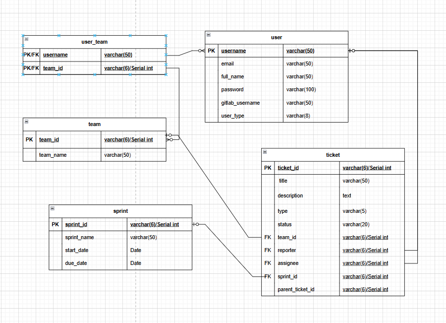

Names:
    Ritik Daswani
    Artem Brandt

## Design choices: 
# 1.Database Schema Design:
1. Employee Table:
Columns: employee_name (PK), email, full_name, gitlab_username, employee_type, hash, salt, active.
Purpose: Stores employee details and credentials. active indicates the online status of the employee.
2. Team Table:
Columns: team_id (PK), team_name.
Purpose: Stores team details.
3. Employee-Team Table (Associative table):
Columns: employee_name (FK), team_id (FK).
Purpose: Many-to-many relationship between employees and teams.
4. Sprint Table:
Columns: sprint_id (PK), sprint_name, start_date, due_date, status, team_id (FK).
Purpose: Stores sprint details, with each sprint assigned to a team.
5. Ticket Table:
Columns: ticket_id (PK), title, description, type, status, git_branch, reporter (FK), assignee (FK), sprint_id (FK), parent_ticket_id.
Purpose: Stores tickets and their relationships to employees (reporter, assignee) and sprints.

# 2.Use of Indices:
Indices have been created on frequently queried columns to improve the performance of the database, particularly on columns involved in joins and searches.

# 3.Password Management:
The use of hashed passwords with salt stored in the employee table ensures that passwords are securely stored. Passwords are not stored directly in the database in plain text, but rather in a hashed format using a secure hashing algorithm.
The PasswordManager class handles the validation of passwords by comparing the stored hash with the hash of the entered password, enhancing security.

# 4. Boolean Handling for Online Status:
Initially, you had the online column to represent the employee's online status, but it was changed to active to better reflect the status of an employee.
The toggle_online_status function was implemented to toggle the active status of an employee. This can be used to mark the employee as "online" or "offline" (or active/inactive).

# 5. User Interface and Interaction:
The system uses a text-based interface with menu options for logging in as an admin or a contributor, viewing employee info, viewing team details, and toggling the employee's active status.
Graphical pop-ups (using JOptionPane) are used for password entry, providing a simple user interface for login credentials.
The welcomeScreen and welcomeScreenOptions methods provide the user with available actions and allow the user to either continue with tasks or exit and re-login.

# 6. Session Management:
The application maintains the session for the logged-in employee. Upon selecting the exit option in the welcomeScreenOptions, the employee’s status is toggled to offline (active set to false), and the application allows the user to re-login.

## How to run it
1)Create tables using structure.sql
2)Insert data using values.sql
3)Create indices and functions with respective sql files
4)Run Admin.java to insert hashed passwords
5)Ready to run main app
Final erd:

